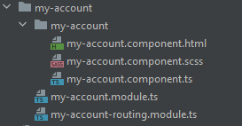
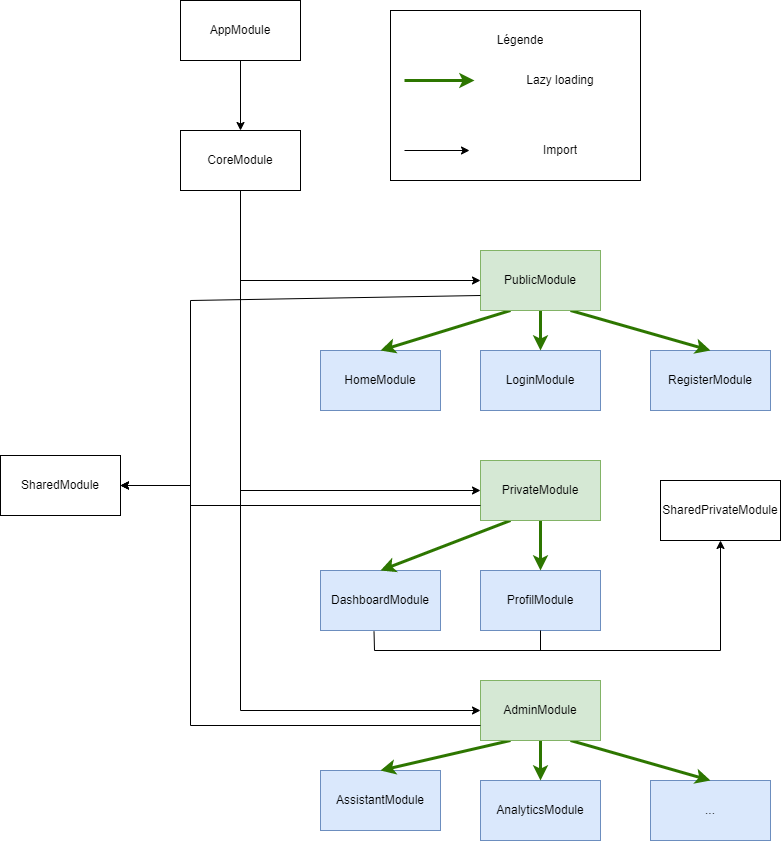

= Angular Architecture
FABRE Laurent
v0.1, 17/05/2022: Première version
:toc:
:icons: font

== Version
[horizontal]
Angular:: *13.3*

== Présentation

=== Objectif
L'objectif de ce projet est de présenter une proposition d'architecture
pour un projet Angular.

== Les différents Modules
Le but de cette architecture est de structurer l'application grâce à différents modules. +
Chaque module ayant un objectif bien distinc.

=== App Module
==== Rôle :
L'app Module est le premier module de chaque application angular. +
Celui-ci doit rester le plus simple possible. +
Il n'a qu'un seul composant (l'*AppComponent*) qui contient dans son DOM les importations des composants génériques (Menu, toaster, loader etc ...) contenu dans le _CoreModule_ (C'est le seul module qui l'importe) et ses imports restent très limités.

[source,typescript]
----
declarations: [
    AppComponent
  ],
  imports: [
    BrowserModule,
    AppRoutingModule,
    CoreModule
  ]
----

==== Routing :
Nous retrouvons dans son routing les redirections en cas d'erreur ou d'URL vide.
(Le routing vers les différentes pages se situe dans les _Area Module_).

Exemple :
----
const routes: Routes = [
  {
    path: '',
    redirectTo: '/accueil',
    pathMatch: 'full'
  },
  {
    path: '**',
    redirectTo: '/accueil'
  }
];
----
TIP: Le path sans paramètre ( _path: ''_ ) indique la premiere page de l'application.
Ici nous retrouvons généralement la page d'accueil du site. +
Les deux astérisques, ' * * ', indiquent à Angular que cette route est une route générique qui n'est pas référencée dans l'application.
Le choix courant amène l'utilisateur vers une page _NotFound_. +
Exemple : { path: '****', component: PageNotFoundComponent }

=== Core Module

==== Rôle :
Le rôle du *_CoreModule_* est d’alléger le module racine de l'application.

* On n’importe jamais le CoreModule dans un autre module que l'AppModule.
* On importe tous nos services, guard, interceptors ... dans le CoreModule.
Ils seront accessibles dans tout votre projet, et il n’y aura qu’une seule instance de chaque service qui existera dans l’application.
* On peut avoir le modèle des DTO dans ce module.
* On peut également ajouter des composants globaux de l'application.
Par exemple :
** Un composant représentant le loading de votre application.
** Votre pied de page.
** Votre menu
** etc... Pour faire simple, il s’agit des composants que vous n’utiliserez que dans le template racine app.component.html.

Ce module à un constructeur un peut particulier :

[source, typescript]
----
constructor(@Optional() @SkipSelf() parentModule: CoreModule) {
    if (parentModule) {
      throw new Error('CoreModule is already loaded.');
    }
  }
----

Ce constructeur permet de vérifier que le module sera instancié qu'une seule fois.

* *_@Optional_* est une annotation qui s’applique sur un paramètre de constructeur.
Elle permet d’indiquer qu’une dépendance est optionnelle.
Si la dépendance n’est pas renseignée, alors c’est la valeur null qui est injectée.
* *_@SkipSelf_* est une annotation qui s’applique également sur un paramètre de constructeur.
Elle indique au mécanisme d’injection de dépendance d’Angular que la résolution de cette dépendance doit commencer à partir de l’injecteur parent.
Pour faire simple, le CoreModule ne peut être instancié qu’une fois, et depuis un module parent uniquement.

==== Routing :

Le core module n'a pas de fichier routing car il ne contient pas de page.
C'est le rôle des *_Area Module_*.

=== Page Module

==== Rôle :

Pour gagner en efficacité, il est recommandé d'utiliser le lazy loading pour charger les "différentes pages" de notre application.
Pour ce faire chaque "page" (représenté par des compostant angular) seront organisés en modules.

_Exemple_ : Les composants Angular qui représenteront la page "Mon Compte" seront dans un Module MyAccountModule avec l'architecture suivant :

Nous retrouvons le fichier modules *my-account.module.ts* qui contient la déclaration de ses différents composants dans notre cas seulement MyAccountComponent, ainsi que ses imports.
(Nous reviendrons sur l'utilité du module _Shared_).

[source,typescript]
----
@NgModule({
  declarations: [
    MyAccountComponent
  ],
  imports: [
    SharedModule,
    MyAccountRoutingModule
  ]
})
----

Ansi qu'un ou plusieurs composants qui constituent la page "Mon compte".
Ici le composant principal a le même nom que son module pour le repérer plus rapidement.

==== Routing :

Le routing d'un module qui représente une page est tres simple, car il pointe uniquement sur le composant principal de celui-ci.

_Exemple_ :

[source,typescript]
----
const routes: Routes = [
  {
    path: '',
    component: MyAccountComponent
  }
];
----

Ce qui signifie que dès que ce module sera charger il chargera son composant principal (ici _MyAccountComponent_).

=== Area Module

==== Rôle :

Les AreaModule contiennent les "modules page" (voir plus haut) qui ont des points communs.

On peut donc faire plusieurs découpages selon la nature de votre application.

*_Découpage par droit de l'utilisateur :_*

Si votre application à plusieurs niveaux de visibilité (invité, user, manager, admin etc ....), il peut être intéressant de découper votre site et donc ses modules (page) de la manière suivante :

* PublicModule (Contiendra tous les "modules page" accessibles sans être connecté comme l'accueil, la page login, le A propos etc ...).
* ProtectedModule (Contiendra tous les "modules page" accessibles uniquement si l'utilisateur est connecté comme son compte, son tableau de bord etc ...).
* AdminModule (Contiendra tous les "modules page" accessibles uniquement si l'utilisateur à le droit admin comme des pages de paramètres etc ...).
* ...

*_Découpage par domaine métier :_*

Vous pouvez aussi découper votre application par domaine métier par exemple pour un site pour un concessionaire on pourrait imaginer un découpage avec un module pour la présentation du concessionaire (page présentation , contact etc ...), un autre pour la présentation des modèles, un autre pour la partie garage etc ...

==== Routing :

C'est dans le fichier routing d'un area module que l'on charge tous ses "modules page" en _lazy loading_.

=== Shared Module

==== Rôle

Le rôle du SharedModule est de centraliser l’importation des composants, des directives et des pipes, qui sont partagés par différents modules dans notre application.

* Le SharedModule consiste uniquement à déclarer ces éléments communs, et à les réexporter ensuite.
* Le SharedModule peut également servir à rassembler les importations récurrentes d’autres modules, comme le CommonModule ou le FormsModule.
Cela évite de réécrire les mêmes importations dans tous les modules.
Pour rappel, le CommonModule doit être importé dans tous nos modules exceptés le module racine.
Il s’agit de la brique minimale dont un module Angular a besoin pour fonctionner.
* Le SharedModule doit être importé dans tous les autres modules qui en ont besoin, y compris le module racine AppModule si besoin.

==== Routing :

Le shared module n'a pas de fichier routing car il ne contient pas de page.

C'est le rôle des *_Area Module_*.

== Réalisation

Voici le schéma de l'implémentation de cette architecture pour notre projet :

=== But

Nous retrouvons ici tous les modules d'écrit plus haut :

- L' *_AppModule_* qui est le départ de l'application.
On voit bien dans le schéma qu'il importe uniquement le *_CoreModule_*.
Voir description de l'<<_app_module>>.
- Le *_CoreModule_* qui importe tous les *_Area Module_* et qui est importé uniquement par l' *_AppModule_*.
Voir description du <<_core_module>>.
- Nous voyons ici que le *_SharedModule_* est importé par tous les *_Area Module_*, mais il peut être importé aussi par tous les modules qui en auraient besoin.
Dans le projet, il peut y avoir aussi des modules shared comme le *_SharedPrivateModule_* qui sont impotés par plusieurs modules qui ont les mêmes besoins (ici les différents private page module).
Voir description du <<_shared_module>>.
- Les *_Area Module_* sont représentés en [green]#vert# dans le schéma.
Voir description <<_area_module>>.
- En [blue]#bleu# nous retrouvons les *_Page module_*.
Voir description des <<_page_module>>.

=== Ligne de commande

Voici quelques lignes de commande pour la création des différents modules :

[source,shell]
----
// Pour démarrer
ng new angular-archi  --prefix=app --style=scss --routing

ng generate module core --module=app (--module=app car il est importé par le module app)
ng generate module shared (pas de routing n'y d'import automatique)

// Area Module (ils seront importé automatiquement dans le module core (--module=core) et ils auront tous un système de routing (--routing))

ng generate module public --module=core --routing
ng generate module protected --module=core --routing
ng generate module admin --module=core --routing

// Page Module
ng generate module protected/my-account --routing

----

== Conclusion

Nous arrivons à la fin de la présentation. +
J'espère avoir pu vous montrer les différents avantages d'utiliser cette architecture. +

N’hésitez pas à me contacter pour toutes remarques ou propositions d’évolution. +
Bon dev à tous !
